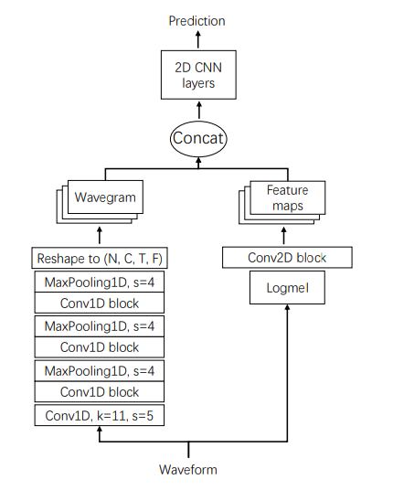

# 病床噪声识别与结果分类工具

  
这是一个基于paddle的噪音识别与分类工具。由于目前产间内CT、MR移动病床在进行水平位移和垂直位移时会产生与预期不符合的噪音，且噪音的出现一半由零件磨损
、障碍物阻挡等原因造成，如何定位噪声源并确认噪声类型、使得测试员快速调试解决问题，便为本项目的目的。
> **注意：** 训练数据集解压后存放在对应的文件夹内，解压到根目录命名对应的位置即可。  
> 1. 目前测试脚本paddleAudio-Linux-noise-recognize.ipynb中内容包含【数据导入与预处理】【模型训练与验证】，请在Linux下运行。
> 2. 目前项目未完成，只完成了可行性验证。


## 项目需求
目的是为了实现实验室质检区噪源分析自动化与人工维修工作中终端快速故障源定位问题。  
> 预期目的：
> - 1）区域噪声源分析自动化：实验区域内不同产品进行耐久度等质量测试。质检人员需要时刻记录故障声音源，确定存在问题的设备，并基于文档更替可能的问题零件来确认故障原因。该流程不仅耗时长，且需要质检员工具有丰富的工程经验，因此如何利用视频流、声音流进行实时问题监听、检测、定位和分类操作从而减轻人工成本，为产业数字化转型的目标之一。通过在指定位置布置摄像头、麦克风等检测设备并使用相关模型技术对结果进行分析，能更好提高质检区域效率。
> - 2）终端快速故障源定位：如需要质检员工在实验室以外进行排错维修工作，部署在私人终端（如PC与远程服务器）的故障分析软件不但可以减轻员工排查效率，还能弥补新员工工程经验缺乏等问题。通过个人终端部署的模型软件，员工能够以更少的时间和器械成本实现对设备维护检修的需求。


### 1. 目前已知的噪音（可后续补充）
| 噪声类型      |     噪声特点      | 出现位置             | 问题估计 |  
|:----------|:-------------:|:-----------------|-----:|
| 尖锐金属摩擦声   | 高频；持续时间长；非周期性 | MR床垂直向上位移时剪型支架发出 |   .. |
| 传送带障碍物阻碍声 | 中高频；持续时间长；周期性 | MR床水平前后拖链阻碍发出    |   .. |
| 噪声3       ||||
记录噪声的原因有助于数据集Label的构建，使得模型输出结果更具指导性。

## 项目实现逻辑
### 1. 模型搭建

1. 噪声源分类。建立逻辑回归模型来区分器械声音是否是噪音。样本token分别正常运行声音与噪声声音.wav。需要对声纹处理编码，转化为可识别的token经行训练。其中需要对噪音进行特征处理，从而提高非噪音源（如背景人生，区域白噪音）带来的对准去度的影响。
2. 位置特征和时隙同步。结合CT病床位移空间位置（或相对位置）与音频时隙相结合（动态时间规划问题），从而在步骤一的基础上确定噪音出现的位置。
3. 多分类回归问题。判断噪声类型，区分混叠。


### 2. 模型读数逻辑

1. 第一步：分帧、预加重、加窗：因为语音信号在10~30ms质检，其基本特征保持不变、即语音信号是短时平稳的，进行评语分析时需要一帧一帧分析处理，加窗指的是FFT变化时家的滤波器矩形窗在此过程中会出现频谱泄露，即防止某一频率的信号能量阔扫到相邻点的现象，典型的，就是在频域直接加窗，会使得窗函数在频域中出现，两点要求，加窗主板精良窄，旁瓣增益尽量小且频率尽量快衰减。正常来说使用汉明窗或者汉宁窗来替代矩形窗。窗长也对采样信号有影响，长窗频率分辨率较好，起到二时间上平均的作用，短窗具有较好的时间分辨率，能够取出语音信号中短时变化。
2. 第二步：STFT、小波变化、短时傅里叶变化就是避免传统傅里叶变化导致其丢失了时域信息，无法看到时频关系的问题。第一步的或称就是短时傅里叶变化，STFt并得到其声谱图：
3. 第三步：计算梅尔普。传统声谱图较大，通常通过梅尔尺度滤波组，变为梅尔频谱，梅尔频率变化后，人儿对频率的感知度就变为线性。STFT算法，假定信号有指定评论，即n_fft这个参数决定基础频率，如n_fft=256其实表示设定了128组不同频率（10hz,20hz,30hz…3Khz）线性变化的三角函数构成，时域上不太好计算，但转成复数好计算，（类似于技术展开），调用PYTHON函数后得到一个信号矩阵，元素由复数ai+bij组成，即复数矢量，则可计算幅度和相位。
4. 第四步：确定梅尔普参数：
>  需要设定的参数如下：  
>  已知采样率SR，和时间总长度Time
>- 窗长win_length: 确定分组的基频
>- Hop——length帧移，一般是10ms，确定得到多少组帧，一般为25ms
>- n_fft，希望得到多少组谐振（常见128）
>- 梅尔谱：其会对原始频率的低频部分进行较多的采样，从而对应更多的频率，而对高频的声音进行较少的采样，对应较少的频率
5. 梅尔倒谱：梅尔普就是对数相对于SFTF属于对数变换，得到80维度的梅尔谱，更加接近人耳的听觉感知，DCT变化【离散余弦变换，一种有损压缩变换，更具窗口大小决定单幅图像的压缩率，即对声谱图进行压缩】麻将梅尔频谱变化成梅尔倒谱                       

6. 预处理逻辑如下图：


### 4. 项目Pipeline
项目工作流大致如下：


## 主要技术原理以及框架
> 注意：目前程序没完成，仅完成了基于PaddleAudio的PANNs网络的噪音分类


### 1. PANNs网络 [链接：PANNs网络](https://github.com/qiuqiangkong/audioset_tagging_cnn)
PaddleOCR旨在打造一套丰富、领先、且实用的OCR工具库，助力使用者训练出更好的模型，并应用落地。



1. 使用理由：PANNs网络为经典的声纹分类backbone，本质上是基于庞大音频数据训练完成后的预训练模型，网络模型简单易改造。
2. 模型权重：使用模型最新的权重包，通过飞浆PaddleEngine自动下载到本地。
3. 预训练数据集：GTZAN：1000个30秒长的数据，10各种类，每个种类有1000tracks，所有的tracks均已22050Hz 单声道16-bit采样.wav格式
3. 模型推理：待处理音频需要经过预处理才能输入模型进行推理判别。

  

### 2. PaddleSpeech工具箱 [链接：PaddleSpeach](https://github.com/PaddlePaddle/PaddleSpeech?tab=readme-ov-file)
PaddleSpeech 是基于飞桨 PaddlePaddle 的语音方向的开源模型库，用于语音和音频中的各种关键任务的开发，包含大量基于深度学习前沿和有影响力的模型，


1. 使用理由：少部分支持Audio处理和预训练模型准备的工具箱，中文文档和社区也比较方便进行开发和调试。
2. 模型选择：PaddleAudio.PAMMs.CNN14 
3. 模型推理：目前模型推理用的云端推理环境（Kaggle），效率较慢。
>  PS：如果后续由更好的基于Windows工具箱，欢迎补充。
 

## 开发者内容
### 1. 安装
1. Git到本地，工程中包含已收集的数据集，可使用utils/wavCollect.py收集需要的音频文件。
2. （暂时）：在Linux环境下运行paddleAudio-Linux-noise-recognize.ipynb脚本，注意更改训练集和测试集的路径。


```diff
尽量维持原先目录结构，运行的目录环境为../mmpose
```  

### 2. 更新
【2024.10.11】增加了ReadMe文档。


### 3. 使用方法
1.未完成
   
  
### 4. 报错处理:  
可能测试notebook脚本时会出现版本冲突问题。


### 4. 后续更新


